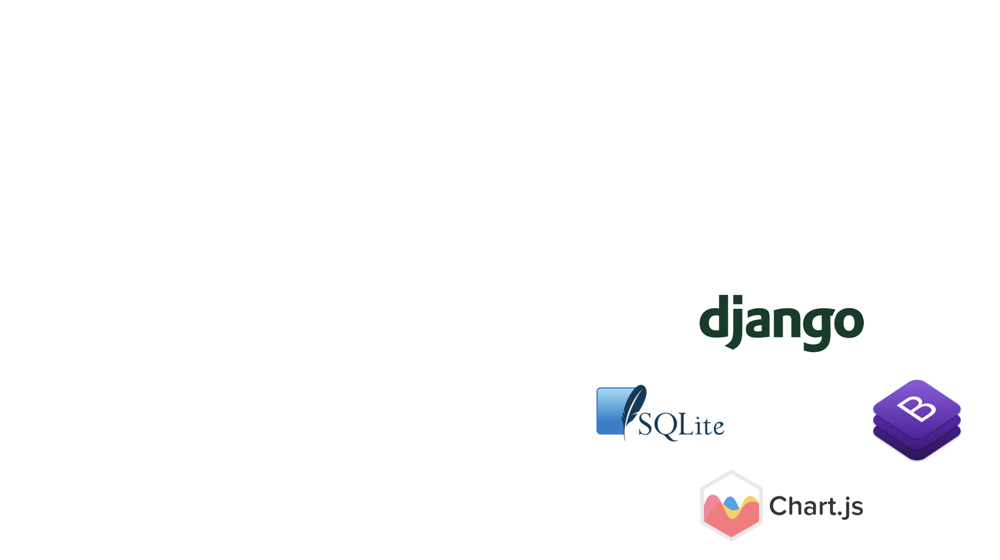
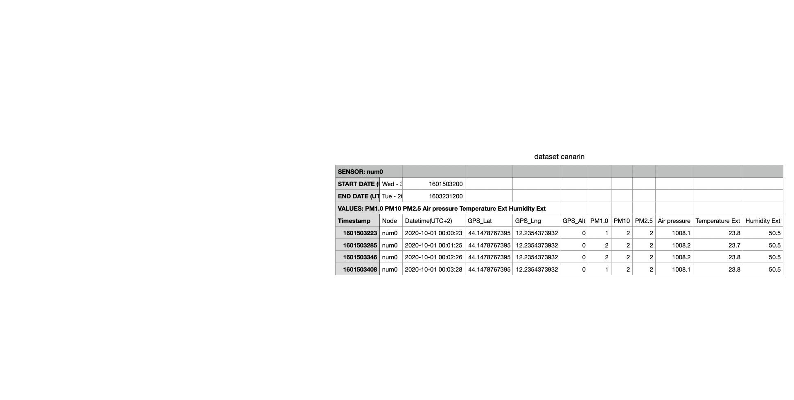

## Intro.
### Canarin Dashboard is a data visualization platform designed for Canarin II
Canarin II sensor is prevalent to collect data among researchers in IoT.  But the raw data collected by the sensor is not easy for users to read. To solve this problem, we show data in chart form and make users be able to interact with data.

---
# Technical Stack
## A Python driven Web App


Back-ended: 
* Django 2 
* SQLite 3

Front-ended: 
* BootStrap 
* Chart.js

---
## Design and Implementations
### Snippets of Codes

---

## Data Entry 

[~/dashboard/db.sqlite3](~/dashboard/db.sqlite3)

```sql
-- Database Design
CREATE TABLE IF NOT EXISTS "data_data" (
    "id" integer NOT NULL PRIMARY KEY AUTOINCREMENT,
    "timestamp" integer NOT NULL,
    "gps_lat" real NOT NULL,
    "gps_lng" real NOT NULL,
	"gps_alt" integer NOT NULL,
    "pm10" integer NOT NULL,
    "pm2_5" integer NOT NULL,
    "airpressure" real NOT NULL,
    "temperature" real NOT NULL,
    "humidity" real NOT NULL,
    "node" varchar(40) NOT NULL,
    "datetime" datetime NOT NULL );
```


---
## Data Entry (cont.)

```python
# URL router
urlpatterns += path('raw_data/', views.RawDataView.as_view(), name='raw_data')
urlpatterns += path('data_upload/', views.data_upload, name='data_upload')
```

```python
# Raw data table view class
class RawDataView(ListView):

# Data manuplation helper method: fillna
def correct_null(str, prv, index):
    if str == '':
        return prv[index]
    else:
        return str

# CSV data uploader
def data_upload(request):
    return render(request, template, {'section': 'data_upload', 'success': 'Upload Success!'})

```

---
## Data Entry (cont.)

```html
<!-- Upload page -->
<div class="card card-default">
    <div class="card-header card-header-border-bottom">
        <h2>Upload Zone</h2>
    </div>
    <div class="card-body">
        <form action="" method="post" enctype="multipart/form-data"> 
            <label for="file1"> upload a file</label>
            <input type="file" id="file1" name="file" class="input-lg">
            <small>only accepts csv files</small>
            <button class="ladda-button btn btn-success btn-square btn-ladda" data-style="zoom-in" type="submit">
            <span class="ladda-label">Submit!</span>
            </button>
            <p style="color: tomato">{{ success }}</p>
        </form>
    </div>
</div>
```
---
## Data Visualization

```python
# Home page view
class HomePageView(TemplateView):

# Simplify datetime helper method
def simpleDatetime(datetime): return "%s-%s %s" % (m, d, time)

# Fetching server memory usage helper method: supporting macOS and Linux
def mem(): return math.floor((perc * 100) * 100) / 100
```

```python
# Node selector
urlpatterns += path('node/<str:node>/', views.home, name='home')

# Home page
urlpatterns += path('', views.HomePageView.as_view(), name='homepage')
```
---
## Data Visualization (cont.)

```html
<!-- Node Info -->
Current Node: {{ node }} <br>

<!-- Node Selection with Map-->

	<a href="">  </a>


<!-- Display Node Information -->
<font size="2" color="#ff6347">* select nodes or click map to change node</font>
<div class="card-header">
	<h2>Node {{ node }}'s GPS Info</h2>
</div>
GPS - Longtitute: {{ GPS_lng }} <br>
GPS - Latitute: {{ GPS_lat }} <br>
GPS - Altitute: {{ GPS_alt }} <br>

```

---

## Data Visualization (cont.)

```html
<!-- html canvas -->
<div class="col-xl-8">
	<div class="card card-default">
		<div class="card-header">
			<h2>Air Pressure <i style="color: red"> {{ hasdata }}</i> </h2>
		</div>
		<div class="card-body">
			<canvas id="AP" width="400" height="300"></canvas>
		</div>
	</div>
</div>
```

---

## Data Visualization (cont.)

```javascript
// Chart.js API

var ctx = document.getElementById('AP').getContext('2d');
var myChart = new Chart(ctx, {
    type: 'line',
    data: {
        labels: {{ labels | safe }},          // fetch label data from business logic layer
        datasets: [{
            label: 'Air Pressure',
            data: {{ AP | safe }},            // fetch air pressure data from business logic layer
            borderColor: '#fcb70a',
            backgroundColor: '#feba0d',
            borderWidth: 1
        }]
    }
});
```

---
## Clickable Map

```python
# Map view class: supports select nodes by clicking the floor map
class MapView(TemplateView):
	template_name = 'map.html'

    def get_context_data(self, **kwargs):
        perc = mem()
        context = super().get_context_data(**kwargs)
        context['section'] = 'Map'
        context['perc'] = perc
        return context
```
```python
# Map router
urlpatterns += path('map/', views.MapView.as_view(), name='map')
```

---
## Time Filtering

```python
# Render analysis page with date filter by context data from database
def analysis_filter_render(request, node, start, end):
    ...
	queryset = Data.objects.orderby('-timestamp').filter(datetime__range(start, end))
	return render(request, 'index.html', {
      'data': data,
      'mem_perc': mem_perc,
      'hasdata': hasdata
	})
```

```python
# Time filter router
urlpatterns += path('node/<str:node>/<str:start>/<str:end>/', views.hometime, name='hometime')
```

---

# Thank you!
